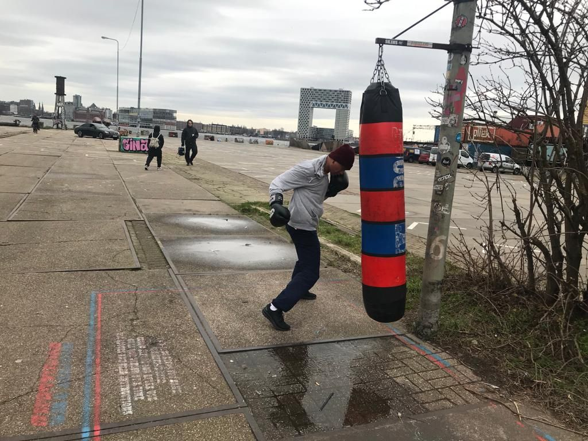

<!-- You should give this document a good title which describes the topic: -->
# Pandemic Sporting in Public Space

<!-- It's always a good idea to start with an image. For example, you could take a screenshot of your work and place it in the images directory of this repository: -->

[Replace the above picture with a picture of your group's project]

## Topic
<!-- In this section, you can describe the topic you and your group have worked on. You can include images, links and everything else supported by the Markdown syntax. Try to make this section not much longer than three or four paragraphs. -->
Data on box ball project: how can we measure which ones are the most used? By weariness?
The Boogieland initiative already have pictures on their map but the Amsterdam outdoor facilities has not (oppurtunity?) Go by all tennistop tables in Amsterdam, on a busy time: 11:00 - 16:00 sunday, make picture: which ones are in use, what’s the score?

## Group

<!-- A brief introduction about your group. Make it playful :) -->
[Introduction]

<!-- This section includes a mandatory table that lists the names of all group members and links to their profile pages:  -->
| Group                                                             |
|:-----------------------------------------------------------------|
| [Leonie van Dijk](team/Leonie.md)   |
| [Frank Kloos](team/Frank.md) |
| [Maaike van Cruchten](team/Maaike.md) |

## Locations

<!-- Start with a description about why these locations are chosen and why they are important for this topic. -->
Amsterdam is the main capital of The Netherlands. It's known to be a city of liberal people.

<!-- This section also includes a mandatory table, this table lists each location and links to their Wikidata items: -->
| Locations                                        |
|:-------------------------------------------------|
| [Amsterdam](https://www.wikidata.org/wiki/Q727)  |

## Data
<!-- Here you can give a short description of the sources you've used. You can describe them in more detail on the page dedicated to data in the [data folder](data/README.md). -->
[Description]

[Data used in this project is described here](data/README.md)

## Final results

<!-- Include a short description about what you've made, your approach, and how you've used the data sources used. -->

<!-- In the table below, add links to an online version of your project, and =, if available, to its documentation and source code: -->
| Results
|:------------------------------------------|
| [Project](https://...)                    |
| [Documentation](https://...)              |
| [Source code](https://github.com/.../...) |
